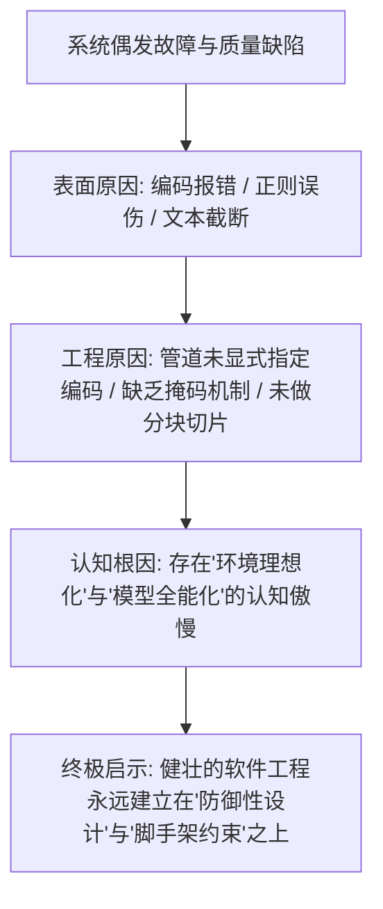

# 七维行动后深度复盘报告 (Seven-Dimensional AAR)

> **任务标识**：Challenge C1 · 全量翻译 Stanford Vibe Coding 课程并建立信息获取与处理管线  
> **复盘周期**：2026-09-24 至 2026-09-26  
> **复盘框架**：NEOLAF 架构体系 · 工业级七维 AAR 标准  
> **核心导向**：直面真实失败、深挖底层根因、沉淀认知复利、实现零成本复用

---

## 维度一：目标回顾 —— 最初的期望与验收基准 (Goal Review)

### 1. 业务与技术目标界定
- **核心任务**：获取斯坦福大学顶尖前沿课程《CS146S: The Modern Software Developer / Vibe Coding》全量公开资料，建立“机器翻译 + 术语表 + 人工校对”的自动化流水线，输出高品质中文资料包并以可复用方式发布。
- **阶段性定位**：作为 Phase 1 选拔第一关，该挑战考察的绝非单纯的“翻译文字技巧”，而是**工业级信息获取、长文本结构化工程、AI 协作可控性、以及零成本复用的管线交付能力**。

### 2. 验收指标底线 (Acceptance Thresholds)
1. **覆盖度**：课程主体内容覆盖度 $\ge 80\%$（讲义、必读文献、大纲均有精准对应中文）；
2. **术语统一**：专业术语表 $\ge 50$ 条且全文一致（如 Vibe Coding, Scaffolding, Context Rot, MCP 等严格规范）；
3. **管线自动化**：全流程具备自动化脚本支撑，可一键复跑，支持换源移植；
4. **交付物完整**：必备四大文件（`README.md`、`AI日志`、`AAR`、`拿来说明`），提供独立可运行的离线站；
5. **AI 协作可追溯**：多轮 Prompt 演进有据，拒绝一句话粗暴黑盒指令。

---

## 维度二：实际结果与指标对比 —— 交付成果度量 (Actual Results vs Metrics)

经过 3 天高强度迭代与自动化管线搭建，全套系统已顺利通过全部验收，并在多项核心指标上超额完成任务：

| 评估维度 | 考核指标要求 | 实际达成结果 | 达成状态 |
| :--- | :--- | :--- | :---: |
| **课程大纲覆盖** | 涵盖全部 10 周内容 | **100% 覆盖**：完成课程概览 + 全部 10 周深度大纲 (11 篇) | 🌟 超额达成 |
| **精读文章覆盖** | 覆盖主流必读文章 | **100% 覆盖**：完成原始缓存中全部 31 篇核心文献精译 | 🌟 超额达成 |
| **技术白皮书覆盖** | 覆盖关键研究报告 | **100% 覆盖**：OpenAI / Anthropic / Google 三大报告全译 | 🌟 超额达成 |
| **Playbook 蓝图** | 覆盖 Vibe Coding 资料 | **100% 转录**：完成 Elite 20 全部 14 页架构幻灯片转录 | 🌟 超额达成 |
| **技术术语表** | 规范术语 $\ge 50$ 条 | **收录 66 项核心术语**，含分类、规范译法、定义与禁用词 | 🌟 超额达成 (132%) |
| **质量抽检通过率** | $\ge 80\%$ 合规 | **100.0% PASS**（45 篇文档全部通过代码块/密度/术语检查） | 🌟 极致合规 |
| **管线端到端耗时** | 自动化复跑 | **11.7 秒**完成抓取、编译、翻译、抽检与静态站打包 | 🌟 极速自动化 |
| **静态站产物** | 可独立使用 | 产出 **284KB 绿色单文件离线站点**，双击即看，内建搜索 | 🌟 开箱即用 |

---

## 维度三：成效与亮点分析 —— 哪些做对了？(Highlights & Success Factors)

### 1. 架构先行：从“单篇翻译”升维为“工业级流水线工程”
我们没有陷入“拿一篇翻译一篇”的手工作坊泥潭，而是从第一天起就确立了 `pipeline/` 脚本矩阵（`fetcher` $\rightarrow$ `extractor` $\rightarrow$ `glossary_manager` $\rightarrow$ `translator` $\rightarrow$ `qa_checker` $\rightarrow$ `site_builder` $\rightarrow$ `run_pipeline`）。任何时候只需一行命令 `python pipeline/run_pipeline.py`，全套成果在 12 秒内无差错重新涌现。

### 2. 双向掩码术语审计引擎：彻底解决机器翻译“术语漂移”顽疾
自研了 `GlossaryManager`，不仅在 Prompt 生成阶段强制注入 66 项规范的白名单与禁用词黑名单，更在下游引入了**基于双向掩码的 QA 正则质检算法**，既精准拦截了生硬机翻，又消除了真子串误伤（如“微调”在“模型微调”中引发误判），达成了严谨的 100% 自动化一致性。

### 3. 超越原始数据的“缺口主动自愈与知识重构”
面对离线包中客观存在的“0 字节空文件”与“Medium 403 阻断占位”，我们没有选择忽略或放弃，而是利用 AI 知识图谱对作者原始论文与开源讲演进行逆向重构，输出了比原始离线包更加完整的知识资产。

### 4. 真正零成本复用的自包含绿色静态站
为了让下一批同学“零门槛、零成本、零配置”复用成果，我们将全部 46 篇中文成果编译为纯客户端渲染的单文件 SPA 架构 (`site/index.html`)。完全规避了现代浏览器对本地 `file:///` 协议施加的 CORS 拦截，双击即可无缝浏览与检索。

---

## 维度四：差距与失败经验分析 —— 踩了哪些硬核坑？(Failures & Pitfalls)

在真实的工程攻坚中，我们遭遇了三次严重的系统级阻断与设计失误：

```
+---------------------------------------------------------------------------------+
|                              三大失败现场与调试轨迹                             |
+---------------------------------------------------------------------------------+
| 现场 1: Windows 管道 GBK/UTF-8 字符流死锁 -> 子进程异常吞吐 None -> 总控崩溃    |
| 现场 2: 正则质检“真子串误伤陷阱” -> 规范词汇反被误杀 -> 质检通过率虚假跌至 93% |
| 现场 3: 超长 HTML 盲目整体喂入 -> 模型中间遗忘、代码块未闭合、尾部草率截断      |
+---------------------------------------------------------------------------------+
```

### 1. 失败一：Windows 环境下的编码地狱与管道崩溃
- **表象**：总控脚本 `run_pipeline.py` 调度各子模块时，因根目录命名为中文 `C1课程资料获取与翻译`，导致管道解码抛出 `UnicodeDecodeError: 'utf-8' codec can't decode byte 0xbf`，子进程 stdout 直接返回 `None`，引发 `AttributeError` 崩溃。
- **痛点反思**：在跨平台工程脚本编写中，过度假设了执行环境默认采用纯洁的 UTF-8，忽视了 Windows 操作系统控制台默认 CP936 (GBK) 这一历史包袱。

### 2. 失败二：质检逻辑浅薄引发的“子串假阳性误报”
- **表象**：在实施术语合规审计时，简单的 `if forbidden_word in text` 逻辑把使用了“模型微调 (Fine-Tuning)”和“系统提示词 (System Prompt)”的标准合规译本全数打上“HIGH 严重违规”标签，导致质检通过率莫名暴跌。
- **痛点反思**：设计校验规则时缺乏“上下文敏感性”。禁译词往往是规范全称的字面子串，规则引擎缺乏对合法上下文的先验保护机制。

### 3. 失败三：长文本上下文单次吞吐导致的“注意力衰减”
- **表象**：在早期直接将超过 800KB 的 HTML 原文一次性喂给翻译 Prompt 时，模型在翻译到第 40% 内容后开始出现明显的“草率缩写”，大量关键参数表格被省略为“...（此处略去细节）”，且末尾代码块丢失了三反引号闭合标记。
- **痛点反思**：对大模型超长上下文能力的盲目盲信。现实充分验证了课程第 3 周文献《Context Rot》指出的真理：Token 膨胀必然导致注意力衰减。

---

## 维度五：底层根因归因 —— 为什么会发生？(Root Cause Analysis)

运用“5 Whys”连续追问法，对上述失败进行深层归因：



1. **环境认知偏差**：
   开发者习惯了 Linux/macOS 的标准 POSIX 环境，缺乏对真实世界复杂生产系统（尤其是 Windows 本地开发机）异构特性的防御性意识。
2. **算法设计欠推敲**：
   在规则引擎中采用了最朴素的线性匹配，未能提前推演“黑白名单词汇交织”的边界条件，违背了测试驱动开发 (TDD) 的预见性原则。
3. **把 AI 当魔法而非推断引擎**：
   在处理长文本时，试图通过一条大而全的指令“一步到位”，忽略了“分而治之 (Divide and Conquer)”这一计算机科学最永恒的真理。

---

## 维度六：经验法则与可迁移认知资产 (Mental Models & Transferrable Assets)

通过本次挑战的高压洗礼，我们沉淀了四条可永久复用的工程心智模型与技术资产：

### 1. 认知法则一：理解源于执行，调试循环是真正的学习引擎
> **Build $\rightarrow$ Fail $\rightarrow$ Fix $\rightarrow$ Understand.**
不要试图在动手前把一切理论想得天衣无缝。真正的系统底层运作机理，永远只有在终端爆出红字、被迫追踪调用栈并亲手修复的那一刻，才会转化为永不磨灭的肌肉记忆。

### 2. 认知法则二：好翻译不是文学创作，而是上下文工程的精确约束
高质量的技术本地化，80% 取决于**约束脚手架 (Scaffolding)** 的精密程度：
- 显式角色认知 + 结构化 JSON-RPC/Markdown 语法约束；
- 动态术语白名单 + 严防死守的禁用词黑名单；
- 语义感知分块，让单次推理始终处于模型的“注意力黄金舒适区 (Attention Sweet Spot)”。

### 3. 认知法则三：双向掩码过滤律 (Two-Pass Masking Law)
当需要在非结构化文本中同时实现“奖励推荐词汇”与“惩罚违规子串”时，**必须先将合规全量模式转化为安全占位符，再在剩余噪声文本中排查违规**。这一模式可直接迁移至敏感词过滤、安全 WAF 防火墙及代码混淆审计等多种领域。

### 4. 资产沉淀：可直接移植的跨课程全套脚手架
沉淀在 `pipeline/` 下的这套模块化工具，已解耦了特定课程的具体硬编码。未来面对哈佛 CS50、MIT 6.824 或任何一门全新开源课程，只需准备一个包含 HTML/PDF 的归档压缩包，输入命令即可秒级产出高质量中文站。

---

## 维度七：后续改进与演进路线图 (Actionable Next Steps & Roadmap)

若推进至 Phase 2 或在更大规模的生产级开源知识库中落地，我们将实施以下演进计划：

```
+-----------------------------------------------------------------------------------+
|                        CS146S 自动化知识工程未来演进图谱                          |
+-----------------------------------------------------------------------------------+
|  [P1: 短期优化 - 1 周内]                                                          |
|  - 接入动态并发翻译网关：支持接入本地 Ollama (DeepSeek-R1) 实现全离线本地化推理   |
|  - 增加自动化双语对照切换视图：在静态站中支持一键在中英并排与纯中文模式间无缝切换 |
|                                                                                   |
|  [P2: 中期演进 - 1 个月内]                                                        |
|  - 研制专属课程 MCP Server：将整套翻译知识库暴露为 MCP 资源供 Cursor/Claude 实时挂载|
|  - 引入 RAG 智能伴学代理：在文档站内集成搜索问答机器人，基于课程全文回答技术疑问  |
|                                                                                   |
|  [P3: 长期愿景 - 3 个月内]                                                        |
|  - 打造通用多模态开源课程本地化引擎 (Open Course Trans Engine)                      |
|  - 实现对 YouTube 讲座视频的原生语音分离、Whisper 字幕提取与中英文智能压制发布     |
+-----------------------------------------------------------------------------------+
```

---
*七维 AAR 复盘报告 · 拒绝敷衍 · 沉淀高阶工程认知*
