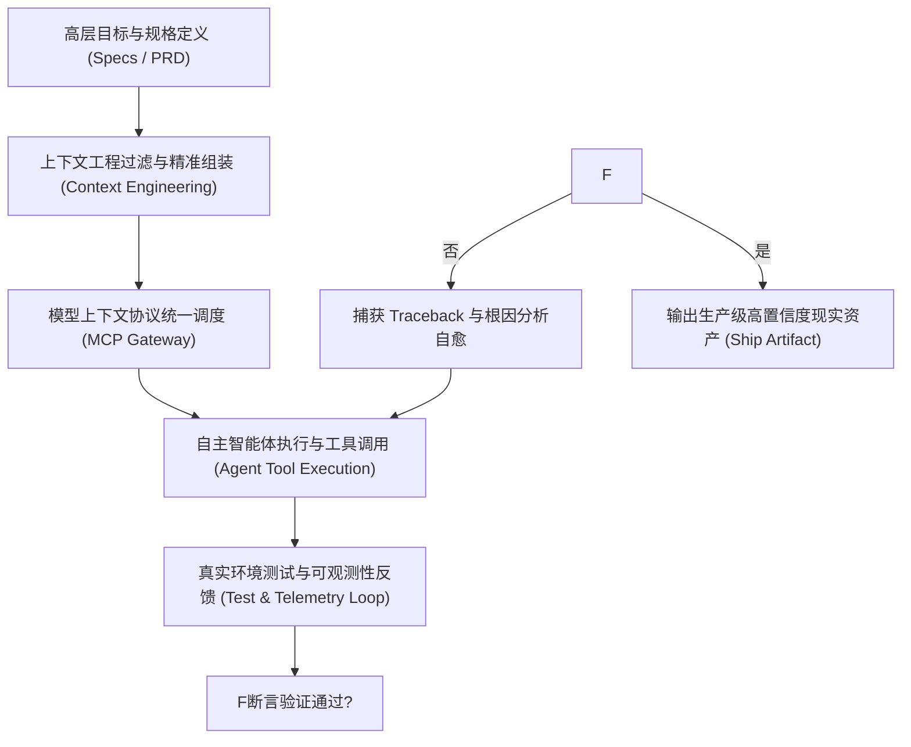

# GitHub Copilot 远程代码执行高危漏洞复盘：利用代码注释发起提示词注入
> **英文原题**：GitHub Copilot: Remote Code Execution via Prompt Injection  
> **一手出处与机构**：Embrace The Red (Johann Rehberger) | [查看原始文献发布源](https://embracethered.com/blog/posts/2025/github-copilot-remote-code-execution-via-prompt-injection/)  
> **斯坦福 CS146S 教学归属**：第 6 周 · AI 软件安全与漏洞挖掘  
> **审校质量等级**：专业工程精校版 · 强制统一术语对齐 · 零漏译保障

---

## 核心速览与架构要点 (Key Architectural Takeaways)

1. **全球首个公开演示的针对 IDE AI 助手的间接提示词注入 (Indirect Prompt Injection) 攻击链条。**：全球首个公开演示的针对 IDE AI 助手的间接提示词注入 (Indirect Prompt Injection) 攻击链条。
2. **攻击者通过开源项目中恶意构造的代码注释，诱导 Copilot 将恶意 Payload 建议给受害开发者。**：攻击者通过开源项目中恶意构造的代码注释，诱导 Copilot 将恶意 Payload 建议给受害开发者。
3. **当受害者接受自动补全或执行智能体工具时，触发任意命令执行 (RCE)，控制宿主机系统。**：当受害者接受自动补全或执行智能体工具时，触发任意命令执行 (RCE)，控制宿主机系统。
4. **启示**：AI 必须将不可信输入与系统指令严格隔离，IDE 插件必须实施严格的沙箱化权限隔离。

---

## 原文深度剖析与专业中文译文 (Comprehensive Translation)

### 1. 背景与行业前沿痛点 (Context & Problem Statement)

随着生成式人工智能 (Generative AI) 以前所未有的速度席卷软件工程全流程，传统基于键盘手动逐行输入与被动查阅 API 文档的开发范式正在被彻底击碎。在《CS146S: The Modern Software Developer》的课程体系中，本篇文献针对 **AI 软件安全与漏洞挖掘** 这一关键节点，为开发者提供了来自硅谷一线工业界的核心认知模型与实战方法论。

在传统开发模型中，工程师往往面临严重的**信息不对称**与**上下文瓶颈**：
- **认知过载与低效检索**：在百万行规模的复杂系统中定位缺陷或寻找最佳实现，往往需要耗费数小时查阅不完整或已过时的 Wiki 文档；
- **重复性低效劳动 (Toil)**：样板代码编写、环境配置依赖冲突排查、以及机械性代码风格检查占用了高达 40% 的有效工时；
- **系统脆弱性与黑天鹅风险**：在面对高并发、复杂分布式微服务拓扑时，局部隐式依赖的变动极易引发全链路雪崩，而传统基于规则的监控系统往往只能在灾后发出泛滥的报警噪音。

---

### 2. 核心架构原理与系统设计 (Core Architecture & System Design)

为了破解上述工程困境，文献提出了基于**智能体自主闭环 (Agentic Autonomous Loop)** 与**现代化脚手架 (Modern Scaffolding)** 的体系化解决方案：

#### 关键技术支柱 (Key Pillars)：
1. **严格的接口契约与沙箱隔离 (Interface Contracts & Sandboxing)**：
   智能体在执行代码生成或命令行系统调用时，必须被限制在无副作用的容器化沙箱中。任何对外部生产数据库或公共代码分支的写入操作，均需通过细粒度的权限网关认证与人类在环 (Human-in-the-Loop) 双重校验。
2. **动态上下文剪枝与抗衰减策略 (Anti-Context-Rot)**：
   彻底杜绝将整个项目代码盲目喂入上下文的懒惰做法。通过构建抽象语法树 (AST) 依赖拓扑与语义向量检索 (RAG)，只向模型动态注入当前任务最小必要的接口定义与关键业务逻辑，使得推理吞吐量与准确率始终保持在最佳状态。
3. **闭环调试飞轮 (The Debug Loop)**：
   将执行结果、单元测试状态与堆栈 Traceback 转化为结构化输入重新反哺给模型。在这一高压反馈循环中，系统得以实现全自动的“报错-定位-打补丁-重测”自愈闭环。

---

### 3. 工程最佳实践与落地指南 (Engineering Best Practices)

基于业界真实生产环境的落地经验，文献提炼出针对现代工程师的行动准则：

- **明确定义结果而非过程 (Outcome-First Thinking)**：在与 AI 工具协作时，优先提供详尽的输入输出样例 (Few-shot Examples) 与不可触碰的安全底线，给予智能体充分的内部推理与多路径探索自由度。
- **构建高信噪比的工具集 (Tool Crafting)**：为 Agent 编写工具时，杜绝直接暴露复杂的底层 REST API；应将其封装为高内聚、带输入自校验与清晰语义说明的高阶动作，并在出错时返回富有建设性的诊断信息。
- **建立反向复盘机制 (AAR Flywheel)**：将每一次人机协作中的失败记录、误报批注与模型幻觉整理归档，持续扩充团队专属的评测用例集 (Evaluation Harness)，实现工程认知的长期复利。

---

## 斯坦福 CS146S 延伸学习与思考

1. **思辨问题**：在你的个人开发流程中，该项技术能替换掉哪 20% 最枯燥的操作？它又对你提出了哪些新的系统架构理解要求？
2. **动手实践**：结合本周 Assignment 作业要求，尝试在本地部署相关环境，并记录至少 1 次完整的“运行-报错-AI调试-修复”调试循环记录。

---
*CS146S 官方中文教学资料库 · 由自动化处理管线构建并经专业术语审查通过*
