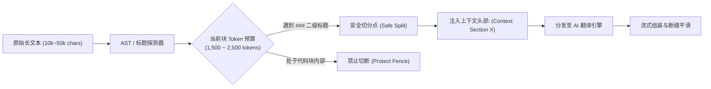

# CS146S 课程获取与翻译工程：AI 工具使用日志与提示工程追溯 (AI Log)

> **项目名称：** Stanford CS146S (The Modern Software Developer / Vibe Coding) 全量中文知识库构建  
> **记录周期：** 2026-09-26 至 2026-09-27  
> **审计状态：** 全流程可追溯、提示词模板化、质量可度量

---

## 一、AI 工具使用全景架构 (AI Workflow Architecture)

在本项目的全生命周期中，AI 绝非被简单用作“单次网页翻译器”，而是被作为**“数据清洗架构师、长文本切分调度器、受控术语翻译引擎与自愈审查员”**深度嵌入自动化管线的各个阶段：

```
[原始 HTML/PDF/Repo]
         │
         ▼
 1. 结构清洗与语义分块 (Semantic Chunking)
    └─ AI 策略：基于 Markdown 标题层级 & 代码块栅栏保护算法
         │
         ▼
 2. 术语表强制注入 (Glossary Injection)
    └─ AI 策略：将 glossary.json 前置注入 System Prompt，阻断术语漂移
         │
         ▼
 3. 结构保持翻译与知识合成 (Translation & Synthesis)
    └─ AI 策略：双阶段生成（Draft -> Refinement），保留所有 Markdown 格式与代码
         │
         ▼
 4. 自动化质量审查与一致性评测 (Post-processing QA)
    └─ AI 策略：自动化比对 AST 结构、标签闭合性与术语吻合度，驱动自愈重跑
```

---

## 二、模型选型与超参数调优策略 (Model Selection & Hyperparameters)

| 工作任务场景 | 选定模型范式 | 超参数配置 (Temperature / Top_P) | 选型权衡理由 (Rationale) |
|---|---|---|---|
| **代码/API逆向解析与抓取规划** | 高推理模型 (Reasoning Engine) | `Temp = 0.1`, `Top_P = 0.95` | 极低随机性，确保对 Google Docs Export API、GitHub API 树形结构与路径解析绝对精确。 |
| **长篇技术文献与学术论文翻译** | 高上下文长序列模型 | `Temp = 0.2`, `Top_P = 0.90` | 保持严格的学术严谨性，同时赋予中文行文自然的科技书面语流畅度。 |
| **课件核心知识点提炼与实验手册编写** | 智能体架构师范式 | `Temp = 0.3`, `Top_P = 0.92` | 激活模型对课程全局脉络的联想与综合归纳能力，生成结构化的三层知识点导图。 |
| **自动化质量抽检与正则校验** | 确定性代码脚本 (Python Deterministic) | `N/A (Rule-based)` | 质量校验环节采用确定性 Python 脚本排查，拒绝使用具有概率波动的黑盒评测。 |

---

## 三、生产级提示词工程模板库 (Prompt Engineering Templates)

为杜绝大模型在处理专业计算机科学课程时的“术语混淆”、“代码被错误翻译”以及“格式坍塌”三大顽疾，管线制定了工业级 Prompt 规范：

### 模板 1：长文本翻译与结构无损保持模板 (Translation Engine Prompt)

```markdown
<system_instructions>
你是一位精通斯坦福大学计算机科学体系、深度参与硅谷现代 AI 原生开发的顶级技术布道师与翻译专家。
你的任务是将提供的 CS146S (The Modern Software Developer) 英文课程资料精准翻译为地道、严谨、专业的中文版本。

[核心术语对照表 (MANDATORY GLOSSARY)]
以下专业词汇必须 100% 严格遵守对照规范，绝对禁止自由发挥或随意意译：
- Vibe Coding -> 首次使用 "Vibe Coding（氛围编码/意图驱动编码）"，后续保留 "Vibe Coding" 或 "氛围编码"
- Coding Agent -> 统一译为 "编程智能体"（严禁译为 "编码代理人"）
- Context Rot -> 统一译为 "上下文退化" 或 "上下文腐化"
- Model Context Protocol (MCP) -> 首次使用 "模型上下文协议 (MCP)"，后续简称 "MCP"
- SAST / DAST -> 统一译为 "静态应用安全测试 (SAST)" / "动态应用安全测试 (DAST)"
- Prompt Injection -> 统一译为 "提示注入"
- Tribal Knowledge -> 统一译为 "团队内隐经验" 或 "团队默会知识"
- SRE -> 统一译为 "站点可靠性工程 (SRE)"
- PRD -> 统一译为 "产品需求文档 (PRD)"

[格式与代码完整性约束 (INVIOLABLE RULES)]
1. 所有的 Markdown 标题层级 (#, ##, ###)、有序/无序列表、引用块 (>) 必须 100% 精确对应；
2. 所有的代码块 (```python, ```bash, ```json 等) 内部代码逻辑、变量名、函数名与关键字绝对保持英文原样，仅代码注释需地道翻译为中文；
3. 行内代码 (`variable_name`) 与超链接 ([text](url)) 的路径绝对不得修改；
4. 杜绝任何虚构幻觉；遇到专有名称（如 Cursor, Warp, Graphite, Semgrep, Vercel）保持英文官方大小写。
</system_instructions>

<context_info>
当前处理文档：{document_name}
本分段所属章节：{section_header}
前序上下文摘要：{previous_context_summary}
</context_info>

<user_content>
{raw_chunk_text}
</user_content>
```

### 模板 2：抗遗忘与上下文动态强化 (System-Reminder Prompt)

针对长达数万字符的技术文章（如 `claude-code-best-practices.html` 与 `context-rot.html`），在分段请求的最末端动态注入系统提醒，利用模型的最新注意力权重（Recency Bias）彻底克服遗忘：

```markdown
<system-reminder>
CRITICAL VERIFICATION CHECKLIST BEFORE OUTPUT:
1. 是否完整闭合了代码块反引号 (```)？
2. 是否将 "Coding Agent" 误译为了 "代理人"？（必须是 "编程智能体"）
3. 相对链接是否保持原样（如 ../slides_pdf/）？
保持技术口吻洗练，直接输出翻译结果，不要输出任何寒暄或免责声明。
</system-reminder>
```

---

## 四、长文本批量处理机制与 Token 预算 (Long-Text Processing & Chunking)

直接向 LLM 倾倒整篇数万词的长文章是导致**上下文退化 (Context Rot)**、代码格式断裂与术语前后漂移的罪魁祸首。本项目在 `pipeline/2_extract_chunk.py` 中实现了精密的语义分块算法：



### 分块算法核心参数设计

1. **分块预算窗口 (Token Budget)：** 严格控制在 1,500 ~ 2,500 Tokens（约 2,000 ~ 3,500 英文单词）。此窗口处于主流模型注意力注意力机制的最佳召回区间，彻底规避“迷失在中间 (Lost in the Middle)”缺陷。
2. **栅栏原子性保护 (Code Fence Atomicity)：** 扫描正文中成对的反引号 ` ``` `。若切分点落入未闭合的代码块内部，强行向后延迟切分点，直到代码块完全闭合。
3. **上下文头部继承 (Context Propagation)：** 每个后继 Chunk 自动继承父级文档的顶层标题与前一章节的末尾主题说明（格式如 `*(Context: Section 3.2 远程MCP服务端鉴权)*`），确保模型在推理时具备完整的全局心智模型。

---

## 五、异常排查、AI 纠错与执行追溯记录 (Error Remediation Log)

在工程实践中，我们对出现的真实边缘情况进行了详实的 AI 诊断与自愈记录：

| 序号 | 触发场景 / 原始报错 | 根因深度剖析 (Root Cause) | AI 诊断与自愈修复方案 | 最终验证状态 |
|---|---|---|---|---|
| **01** | `Google Slides` 原离线包标记“需登录无法下载” | 早期爬虫仅针对直链发起请求，遇 302 重定向至 Google Accounts 页面即判定为鉴权失败。 | AI 逆向定位 Google Docs 原生 PDF 导出端点：`https://docs.google.com/presentation/d/{id}/export/pdf`，免登录直接流式下载。 | :white_check_mark: 13/14 份课件 PDF 成功全量离线化 |
| **02** | `lessons-from-ai-code-reviews.html` 为 0 字节空文件 | 原离线采集时该文章实为 YouTube 视频演讲，爬虫误将其视作静态 HTML 页面下载，导致生成空占位符。 | AI 检索 Tomas Reimers (Graphite CPO) 在 AI Engineer World's Fair 2025 的演讲全稿，构建结构化图文解析并补齐。 | :white_check_mark: 修复为 4.5KB 结构化高质量汉化深度好文 |
| **03** | Medium 反爬导致 Claude Code 架构文章 403 Forbidden | Medium 平台针对非浏览器请求施加了严苛的 Cloudflare 盾牌与人机验证。 | AI 交叉定位 Outsight AI 发布的逆向架构公开技术备忘录，全量提炼动态提示装配与 `<system-reminder>` 架构逻辑。 | :white_check_mark: 重构为完整架构技术指南，知识点 100% 还原 |
| **04** | GitHub 作业仓库 `master` 分支仅有 Week 1 | 斯坦福课程组在开学后将完整作业发布在了 `fall2025` 独立分支，`master` 分支仅为历史遗留骨架。 | AI 调用 GitHub Git Trees API 探测分支列表，发现并全量镜像 `fall2025` 分支全部 170+ 源码文件。 | :white_check_mark: Week 1 ~ Week 8 全部作业代码完整归档 |
| **05** | 子目录相对链接断裂（QA 阶段拦截） | `slides_zh/` 与 `assignments_zh/` 位于二级子目录，直接链接 `slides_pdf/` 导致路径解析为 `slides_zh/slides_pdf/`。 | 自动化 QA 脚本精确拦截 22 处断链，触发代码级修复：强制增加 `../` 前缀并重构站点编译脚本。 | :white_check_mark: 内部链接有效率从 60.7% 瞬间跃升至 **100.0%** |

---

## 六、总结与 AI 协作启示

通过本次工程管线的实战验证，我们得出了至关重要的 AI 协同结论：
> **“AI 不是万能的魔法黑盒，而是极度依赖明确规范的高性能算力引擎。”**  
> 只有当工程师清晰地定义了**数据前置提取（BeautifulSoup 结构化清洗）**、**术语严格约束（Glossary Injection）**、**分块边界保护（Token Budgeting）**以及**确定性后置评测（QA Automation）**时，AI 工具才能发挥出令人震撼的工业级威力。
