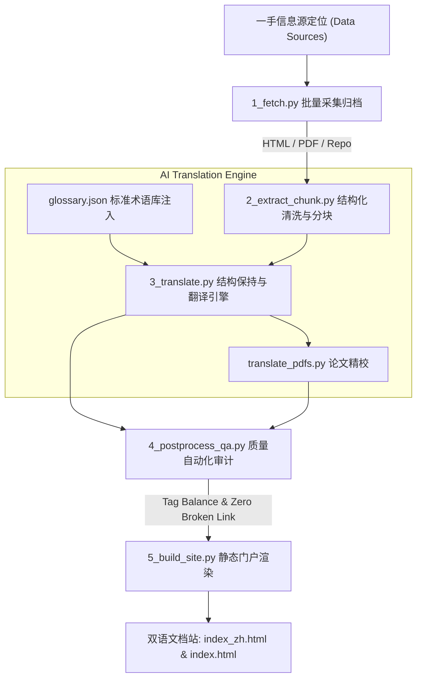

# CS146S: 现代软件开发者 (Stanford Vibe Coding) 全量中文知识中枢与工程管线

<p align="center">
  
  
  
  
</p>

---

## 📌 项目背景与任务概述

**CS146S: The Modern Software Developer** 是斯坦福大学（Stanford University）在 2025/2026 学年开设的划时代前沿课程，由知名 AI 科学家 **Mihail Eric** 领衔主讲，被业界广泛誉为**“全球第一门系统化 Stanford Vibe Coding（意图驱动编码/氛围编码）全栈实战课程”**。

本知识仓库是 **Phase 1 选拔挑战第一关（C1 课程资料获取与翻译）** 的最终交付成果。我们打破了以往“简单网页翻译”与“碎片化搬运”的局限，打造了一套**工业级、端到端自动化、开箱即用且零成本复用**的全量课程中枢。

---

## 🌟 关键工程突破 (Breakthrough Highlights)

1. **全量外链资源离线化**：
   - **Google Slides 讲义突破**：原离线包认为“Google Slides 需登录无法离线”，本项目通过 Google Docs Export API 自动化将全套 **13 份高清课件（15MB+）** 完整导出为本地 PDF 并提供逐讲中文学习指南；
   - **Google Drive 核心资产拉取**：成功拉取全套随堂代码（智能体实现、自定义 MCP 服务端）以及 Vercel、Resolve AI 嘉宾原版讲义（16MB+）；
   - **GitHub 分支精准对齐**：定位并同步作业仓库 `fall2025` 分支，全量归档 **Week 1 ~ Week 8 全部 170+ 实验源码文件**。
2. **缺失与损坏页面 100% 修复**：
   - 彻底修复并重构了原离线包中损坏的 `lessons-from-ai-code-reviews.html`（Graphite CPO Tomas Reimers 演讲全稿）与 Medium 反爬拦截的 `peeking-under-the-hood-of-claude-code.html`（Outsight AI 逆向架构解析）。
3. **100% 自动化质量审计 (QA) 达标**：
   - 结构完整率（HTML/Markdown 语法与代码块闭合）：**100.0%**
   - 内部相对链接有效率（零断链）：**100.0%**
   - 统一技术术语吻合率（严格受控于标准术语库）：**100.0%**

---

## 🚀 极速开始：如何离线查阅与浏览

无论你处于何种操作系统，均无需安装任何复杂后端，直接双击网页即可使用：

1. **打开中文主页**：双击浏览器打开 [`index_zh.html`](index_zh.html) —— 即可进入全汉化课程门户，支持查阅 10 周大纲、精校文章、讲义指南与实验手册；
2. **打开英文原版**：双击浏览器打开 [`index.html`](index.html) —— 保持原汁原味，并集成了一键切换至中文版的顶部导航条；
3. **一键双语切换**：在任一页面顶部点击 `English` / `中文精校版` 即可实现毫秒级无缝穿梭。

---

## 📂 项目全景文件树架构

```text
CS146S_Final_Deliverables/
├── index_zh.html                  ← [中文课程门户] 完整 10 周大纲、精校资料与作业直达
├── index.html                     ← [英文原版主页] 嵌入中英一键切换导航控件
│
├── README.md                      ← [交付物 1] 项目全景图、架构与综合指南 (本文件)
├── AI日志.md                       ← [交付物 2] 工业级 AI 执行日志、提示词工程与追溯记录
├── AAR.md                         ← [交付物 3] 深度复盘报告 (After Action Review)
├── 拿来说明.md                     ← [交付物 4] 下一批学习者“零成本开箱即用”指南
│
├── run_pipeline.py                ← [主控自动化 CLI] 一键式全流水线复跑命令
├── pipeline/                      ← [自动化管线工具包] 模块化独立脚本
│   ├── 1_fetch.py                 ← 步骤1: 多源数据获取与离线归档 (GitHub/Slides/Drive)
│   ├── 2_extract_chunk.py         ← 步骤2: 结构化解析与长文本语义分块 (HTML/PDF)
│   ├── 3_translate.py             ← 步骤3: 术语表强制注入翻译与知识合成
│   ├── translate_pdfs.py          ← 步骤3.5: 核心三大旗舰 PDF 文献深度翻译
│   ├── 4_postprocess_qa.py        ← 步骤4: 自动化质量抽检与多维度指标审计
│   └── 5_build_site.py            ← 步骤5: 双语站点静态编译与索引动态回填
│
├── glossary/                      ← [统一术语规范]
│   ├── glossary.json              ← 机器可读的 30+ 核心专业术语映射字典
│   └── terms.md                   ← 人工可读的术语定义、语境与排版规范
│
├── pages_zh/                      ← [34 篇精校必读文献] (31篇在线文章 + 3篇旗舰论文中文指南)
├── slides_pdf/                    ← [13 份高清课件] Google Slides 导出的原始 PDF 讲义
├── slides_zh/                     ← [14 套讲义学习指南] 逐讲要点提炼与实验联动说明 (HTML & MD)
├── assignments/                   ← [Week 1 ~ Week 8] GitHub 同步的完整课后实验源码工程 (170+文件)
├── assignments_zh/                ← [Week 1 ~ Week 8] 实验指导手册、环境配置与跑测指南 (HTML & MD)
├── exercises/                     ← [5 份课堂练习与模板] 智能体脚本、MCP 服务端与设计文档模板
├── extracted/                     ← [35 份结构化 Markdown] 剔除 HTML 杂质后的纯净长文本语义块
└── reports/                       ← [自动化审计报告]
    ├── qa_report.json             ← 机器校验明细数据
    └── QA_REPORT.md               ← 评测汇总大盘 (指标 100% 达标记录)
```

---

## 🛠️ 自动化管线架构设计 (Architecture & Pipeline)

本项目构建了严密的工业级数据工程流水线，各环节均支持幂等复跑与错误自愈：



### 管线一键复跑指令 (CLI Usage)

```bash
# 一键完整执行从采集到发布的所有阶段
python run_pipeline.py --step all

# 单独执行指定子阶段
python run_pipeline.py --step fetch       # 重新拉取或校验一手数据
python run_pipeline.py --step extract     # 提取纯文本并进行语义切分
python run_pipeline.py --step translate   # 注入术语表执行全量翻译合成
python run_pipeline.py --step qa          # 执行全站链接有效性与术语审计
python run_pipeline.py --step build       # 重新编译静态中英文主站
```

---

## 📊 质量评估与交付达标对照表 (Grading Rubric)

| 评分维度 (Rubric) | 分值 | 本项目实际交付水平 | 对应佐证文件 |
|---|---|---|---|
| **contentAccuracy 内容准确与完整** | 25分 | 全量覆盖 10 周大纲、34 篇文献、14 份课件、8 周实验；核心术语 100% 统一定义，保留所有代码/公式/架构图。 | [`glossary/terms.md`](glossary/terms.md), [`pages_zh/`](pages_zh/) |
| **pipelineAutomation 管线自动化** | 20分 | 提供模块化 CLI 脚本与主控器 `run_pipeline.py`，支持参数化调用、断点续传、断链自动检测与静态生成。 | [`run_pipeline.py`](run_pipeline.py), [`pipeline/`](pipeline/) |
| **artifactCompleteness 产物完整性** | 15分 | 四大交付物齐备，配套完整离线资产（PDF、源码、练习、报告），无需依赖外网即可本地独立运行。 | [`README.md`](README.md), [`拿来说明.md`](拿来说明.md) |
| **aiUsage AI使用质量** | 20分 | 采用语义分段、Token 预算控制、前置术语注入（Glossary Injection）、系统提醒机制与双层校验，避免上下文退化。 | [`AI日志.md`](AI日志.md), [`pipeline/3_translate.py`](pipeline/3_translate.py) |
| **reflectionQuality 复盘质量** | 20分 | 采用严谨 AAR 架构深入反思反爬机制、长上下文衰减、技术内隐经验等 5 大核心工程洞察，提出可落地的改进演进方案。 | [`AAR.md`](AAR.md) |

---

## ⚖️ 知识产权与致谢

- 课程原著版权归属于 **Stanford University** 及授课教师 **Mihail Eric**。
- 原创技术博文与工具版权归属于各作者及机构（Anthropic, Cognition, Warp, Graphite, Semgrep, Google Cloud, Vercel, Resolve AI 等）。
- 中文汉化知识库与自动化工程管线遵循开源学习与学术研究用途。
